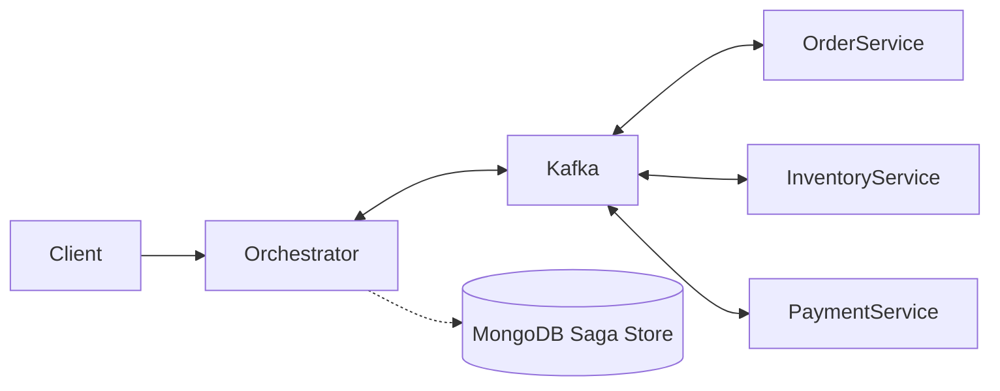

# 🧩 Saga Orchestration with Kafka (Event-Driven Microservices Architecture)

> 💡 **Distributed Transaction Management** using the **Saga Orchestration Pattern** with Apache Kafka, featuring automated compensation flows, state persistence, and decoupled microservices.

---

## 🚀 Overview

This project implements a robust **Saga Orchestration** pattern using **Spring Boot**, **Apache Kafka**, **PostgreSQL**, and **MongoDB**.

It simulates an e-commerce distributed transaction across multiple microservices, ensuring **data consistency** through **asynchronous events** and **compensating mechanisms (rollbacks)**.

---

## 🧠 Saga Workflow

### ✅ Happy Path
`SAGA_STARTED` → `ORDER_SUCCESS` → `INVENTORY_SUCCESS` → `PAYMENT_SUCCESS` → `SAGA_FINISHED`

### ❌ Inventory Failure (Short Rollback)
`SAGA_STARTED` → `ORDER_SUCCESS` → `INVENTORY_FAIL` → `COMPENSATING` → `SAGA_COMPENSATED`

### ❌ Payment Failure (Full Rollback)
`SAGA_STARTED` → `ORDER_SUCCESS` → `INVENTORY_SUCCESS` → `PAYMENT_FAIL` → `COMPENSATING` → `COMPENSATING` → `SAGA_COMPENSATED`

### ❌ Aborted Flow (Initial Failure)
Used when the saga fails at the very first step. Since no resources were reserved, no compensation is needed.

`SAGA_STARTED` → `ORDER_FAIL` → `SAGA_FAILED`

---

## 🏗️ Architecture



---

## 📦 Microservices Ecosystem

*   **`orchestrator-service`**: The brain of the operation. Coordinates the Saga flow, manages state transitions, and persists execution history in **MongoDB**.
*   **`order-service`**: Handles order creation and cancellation (PostgreSQL).
*   **`inventory-service`**: Manages stock reservation and automated compensation.
*   **`payment-service`**: Processes financial transactions and simulates payment failures.
*   **`common-lib`**: Shared library containing event contracts (**Java Records**) and shared DTOs.

---

## 🛡️ Key Technical Features

*   **Stateful Orchestration**: Centralized flow control via a dedicated Orchestrator.
*   **Event-Driven Design**: Services are completely decoupled, communicating only through Kafka topics.
*   **Observability & Tracking**: Full Saga lifecycle tracking with detailed history and timestamps stored in MongoDB.
*   **Transactional Consistency**: Automated rollback logic (compensating transactions) to prevent stale data.
*   **Fault Tolerance**: Designed to handle service failures without losing transaction state.

---

## 📡 Saga Execution Trace (MongoDB Sample)

```json
{
  "orderId": "4ff55c8d-e4f3-43e6-bb51-ec400788f22e",
  "status": "SAGA_COMPENSATED",
  "history": [
    { "step": "SAGA_STARTED", "details": "Iniciando compra do produto: produto-1", "timestamp": "2026-04-21T22:00:49.813+00:00" },
    { "step": "ORDER_SUCCESS", "details": "Pedido criado com sucesso", "timestamp": "2026-04-21T22:00:49.855+00:00" },
    { "step": "INVENTORY_SUCCESS", "details": "Estoque reservado com sucesso", "timestamp": "2026-04-21T22:00:49.898+00:00" },
    { "step": "PAYMENT_FAIL", "details": "Simulação de falha: Pagamento recusado.", "timestamp": "2026-04-21T22:00:49.959+00:00" },
    { "step": "COMPENSATING", "details": "Solicitando estorno de estoque", "timestamp": "2026-04-21T22:00:49.974+00:00" },
    { "step": "COMPENSATING", "details": "Solicitando cancelamento de pedido", "timestamp": "2026-04-21T22:00:50.036+00:00" },
    { "step": "SAGA_COMPENSATED", "details": "Saga totalmente compensada", "timestamp": "2026-04-21T22:00:50.271+00:00" }
  ],
  "createdAt": "2026-04-21T22:00:49.813+00:00",
  "updatedAt": "2026-04-21T22:00:50.271+00:00",
  "finishedAt": "2026-04-21T22:00:50.271+00:00"
}
```

---

## ⚙️ Setup & Installation

### 📋 Prerequisites
*   **Java 17+**
*   **Docker & Docker Compose**
*   **Maven**

### 🔐 Environment Variables
Credentials and sensitive data are not versioned. Use `.env.example` to create your local `.env` file.

### ▶️ Running the System

1.  **Infrastructure**: Spin up Kafka, PostgreSQL, and MongoDB:
    ```bash
    docker-compose --env-file ../../.env up -d
    ```

2.  **Shared Library**: Install the core event contracts:
    ```bash
    cd common-lib && mvn clean install
    ```

3.  **Services**: Run the following command in each service folder (`orchestrator`, `order`, `inventory`, `payment`):
    ```bash
    mvn spring-boot:run
    ```

---

## 🧪 Testing Scenarios

Use these scenarios to validate the orchestration and compensation logic:

*   **✅ Success Flow**: Send any valid `productId` with a standard quantity (e.g., `1`).
    *   *Expectation: Status `SAGA_FINISHED`.*

*   **❌ Inventory Failure**: Send a `quantity` higher than available stock (e.g., `9999`).
    *   *Expectation: Status `SAGA_COMPENSATED` (Order cancelled).*

*   **❌ Payment Failure (Rollback)**: Send a request with **`quantity: 9`**. This specific value triggers a simulated decline in the `payment-service`.
    *   *Expectation: Inventory is reserved, then payment fails, triggering a stock release and order cancellation. Status `SAGA_COMPENSATED`.*

```bash
curl -X POST http://localhost:8080/api/order \
  -H "Content-Type: application/json" \
  -d '{
    "productId": "product-1",
    "quantity": 1
  }'
```

```bash
# Example: Triggering Payment Rollback
curl -X POST http://localhost:8080/api/order \
  -H "Content-Type: application/json" \
  -d '{
    "productId": "product-1",
    "quantity": 9
  }'
```

---

## 📌 Roadmap & Future Evolution

### 🛡️ Phase 1: Resilience & Data Integrity (v1.1)
*   **Idempotency:** Implement `orderId` validation in all consumers to prevent duplicate processing (Exactly-once semantics).
*   **Resilient Messaging:** Configure **Dead Letter Queues (DLQ)** and **Exponential Backoff Retries** for Kafka listeners.
*   **Unit & Integration Testing:** Achieve >80% code coverage using **JUnit 5**, **Mockito**, and **Testcontainers** (for real Kafka/DB tests).
*   **Code Quality:** Integrate **JaCoCo** for coverage reports and **SonarQube** for static analysis.

### 📈 Phase 2: Observability & Monitoring (v1.2)
*   **Spring Boot Actuator:** Expose operational endpoints (health, metrics, info).
*   **Distributed Tracing:** Integrate **Micrometer Tracing** with **Jaeger/Zipkin** to visualize saga spans across microservices.
*   **Metrics Stack:** Export data to **Prometheus** and create rich dashboards in **Grafana**.

### 💰 Phase 3: Business & Performance (v2.0)
*   **Financial Logic:** Implement real monetary values using `BigDecimal` and handle multi-currency support.
*   **Caching Layer:** Integrate **Redis** to cache product availability and reduce database load on the Inventory Service.
*   **API Gateway & Security:** Implement **Spring Cloud Gateway** with **Spring Security & Keycloak (JWT)** for centralized authentication and rate limiting.

### ☁️ Phase 4: Cloud Native & Scaling (v3.0)
*   **Service Discovery:** Use **Spring Cloud Netflix Eureka** or Kubernetes CoreDNS for service communication.
*   **Cloud Config:** Centralize configurations using **Spring Cloud Config** or Kubernetes ConfigMaps.
*   **Orchestration:** Full **Kubernetes (K8s)** deployment with Helm Charts, including HPA (Horizontal Pod Autoscaler).


---


## 👨‍💻 Author

Developed by **[Gustavo Menezes](https://github.com/guhmenezes)**

---

## ⭐ Final Thoughts

This project was built to demonstrate real-world backend architecture patterns used in distributed systems.

If you found it useful, feel free to ⭐ the repository!
